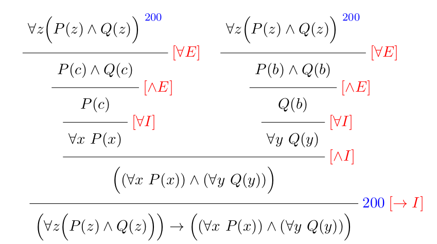
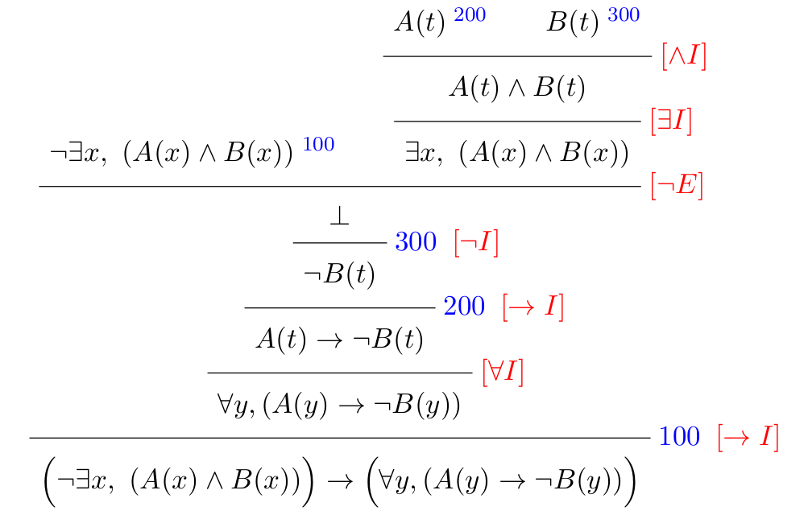
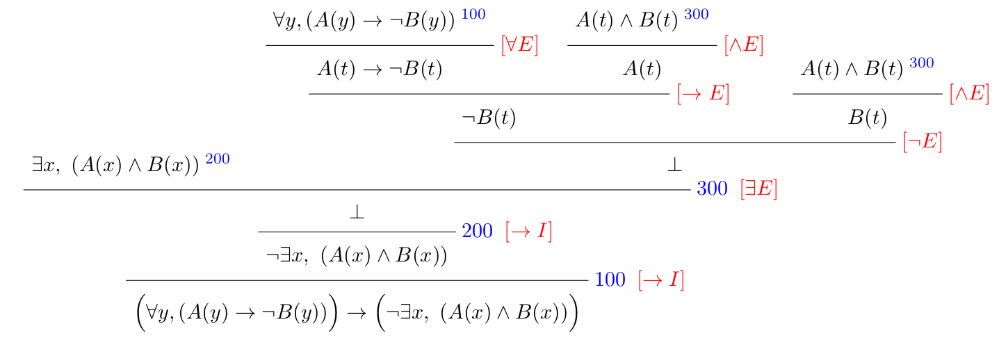
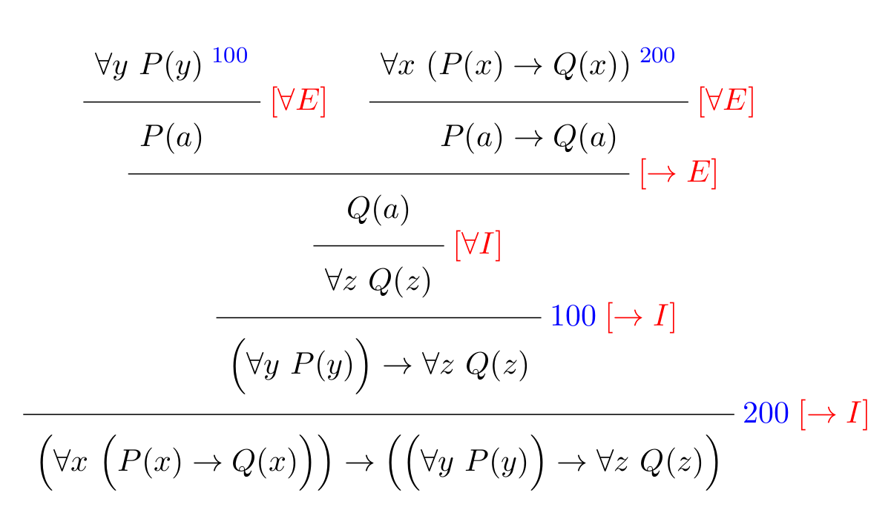
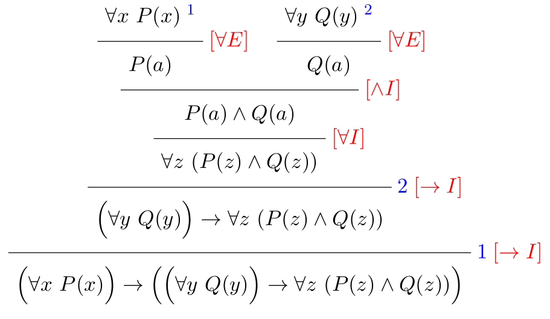

# Problem Sheet on Predicate Logic

## Exercise 1

Over the domain of animals, consider the three predicates
- W(x) = "x is white"
- M(x) = "x is a mouse"
- T(x) = "x has a tail"

- (i) Express the following five sentences in predicate logic
  - (a) All white animals are mice.
  - (b) Basil is a mouse but he is not white.
  - (c) All white mice have tails.
  - (d) Not all mice are white.
  - (d) At least one of Basil and Charlie has a tail.
- (ii) Write your predicates in Lean.

<details><summary>Solution</summary>

- (i)
  - (a) ∀ x, W(x) → M(x)
  - (b) M(Basil) ∧ ¬ W(Basil)
  - (c) ∀ x, [(W(x)∧ M(x))→ T(x)]
  - (d) ¬ ∀ x, M(x)→ W(x)
  - (e) T(Basil) ∨ T(Charlie)

- (ii)
```lean
section animals

variable animal : Type
variables W M T : animal → Prop

--i
#check ∀ x : animal, W x → M x

variable Basil : animal
--ii
#check M Basil ∧ ¬ W Basil

--iii
#check ∀ y : animal, M y ∧ W y → T y

--iv
#check ∃ z : animal, M z ∧ ¬ W z

--v
variable Charlie : animal
#check T Basil ∨ T Charlie

end animals
```

</details>

## Exercise 2

Over the domain of people, use the two predicates
- L(x,y) = x loves y
- H(x,y) = x hates y

to express the following six sentences in predicate logic:

- (a) Bob loves Dele and everybody hates Charlie.
- (b) Somebody loves both Charlie and Dele.
- (c) Bob loves everybody but nobody loves Bob.
- (d) Everyone who loves Dele also loves either Charlie or Bob.
- (e) Everyone who loves Charlie loves someone who loves Bob.
- (f) Everybody who loves everybody loves themselves.

Write the predicates in Lean.

<details><summary>Solution</summary>
  
- (a) L(Bob, Dele) ∧ ∀x, [H(x, Charlie)]
- (b) ∃x, [L(x, Charlie) ∧ L(x, Dele)]
- (c) ∀x, [L(Bob, x)] ∧ ¬∃x, [L(x, Bob)]      
Another answer: ∀x, [L(Bob, x)] ∧ ∀x, [¬L(x, Bob)]
- (d) ∀x, L(x, Dele) → L(x, Charlie) ∨ L(x, Bob)
- (e) ∀x, L(x, Charlie) → ∃y, [L(x, y) ∧ L(y, Bob)]
- (f) ∀x, ∀y, [L(x, y)] → L(x, x)

```lean
section people

variable people : Type
variables L H : people → people → Prop

variables Bob Charlie Dele : people

--(a)
#check L Bob Dele ∧ ∀ x : people, H x Charlie

--(b)
#check ∃ y : people, L y Charlie ∧ L y Dele

--(c)
#check ∀ x : people, L Bob x ∧ ¬ exists y : people, L y Bob

--(d)
#check ∀ z : people, L z Dele → L z Charlie ∨ L z Bob

--(e)
#check ∀ x : people, L x Charlie → ∃ y, L x y ∧ L y Bob

--(f)
#check ∀ x : people, (∀ y : people, L x y) → L x x
--note that here, parentheses are necessary around ∀ y : people, L x y

end people
```

</details>
  
## Exercise 3

Without using Lean, find and correct the mistakes in the following proof, assuming that the first line (the formula) is correct.
```
example (A B C : Prop) : A ∧ (B ∨ C) → (A ∧ B) ∨ (A ∧ C) :=
assume h1 : A ∨ (B ∧ C),
or.elim (and.left h1)
  (assume h2 : C,
    or.intro_right (A ∧ C) (and.intro (and.elim_right h2) h1))
  (assume h2 : B,
    or.intro_left (A ∧ B) (and.intro (and.elim_right h2) h1))
```

<details><summary>Solution</summary>

```lean
example (A B C : Prop) : A ∧ (B ∨ C) → (A ∧ B) ∨ (A ∧ C) :=
assume h1 : A ∧ (B ∨ C),
or.elim (and.right h1)
  (assume h2 : B,
    or.intro_left (A ∧ C) (and.intro (and.elim_left h1) h2))
  (assume h2 : C,
    or.intro_right (A ∧ B) (and.intro (and.elim_left h1) h2))
```

</details>

## Exercise 4

**Does the ordering of the quantifiers matter?**
Let the domain be people, and A(x,y) be the predicate x admires y.
- Express ∀x ∃y A(x, y) in English.
- Express ∃y ∀x A(x, y) in English.
 
Is ∀x ∃y A(x, y) the same as ∃y ∀x A(x, y) in general?

<details><summary>Solution</summary>
  
-  ∀x ∃y A(x, y) in English translates to  ``every person admires someone".
-  ∃y ∀x A(x, y) in English translates to ``there is someone who is admired by everyone".

Hence, ∀x ∃y A(x, y) is not the same as ∃y ∀x A(x, y) in general, i.e., ordering of the quantifiers matters!

</details>
  
## Exercise 5

Show that (∀z(P(z)∧Q(z))) → ((∀x P(x))∧(∀y Q(y))), both in Lean and in natural deduction.

<details><summary>Solution</summary>



```lean
section exo2

variable U : Type
variables P Q : U → Prop

example : (∀ x, P x ∧ Q x) → ((∀ x, P x) ∧ (∀ x, Q x)) :=
assume h : ∀ x, P x ∧ Q x,
and.intro
  (assume t : U, and.elim_left (h t))
  (assume s : U, and.elim_right (h s))

--variant using "have"
example : (∀ x, P x ∧ Q x) → ((∀ x, P x) ∧ (∀ x, Q x)) :=
assume h : ∀ x, P x ∧ Q x,
and.intro
  (assume t : U,
   have k : P t ∧ Q t, from h t,
   and.elim_left k)
  (assume s : U,
   have m : P s ∧ Q s, from h s,
   and.elim_right m)

end exo2
```
  
</details>
  
## Exercise 6

Show that (∃y (¬P (y))) → (¬(∀x P (x))), both in Lean and in natural deduction.

<details><summary>Solution</summary>


```lean
section exo3

variable U : Type
variable P : U → Prop

example : (∃ y, ¬ P y) → ¬ ∀ x, P x :=
assume h : ∃ y, ¬ P y,
assume k : ∀ x, P x,
exists.elim h
(assume t : U,
 assume np : ¬ P t,
 np (k t)
)


--variant using "have"
example : (∃ y, ¬ P y) → ¬ ∀ x, P x :=
assume h : ∃ y, ¬ P y,
assume k : ∀ x, P x,
exists.elim h
(assume t : U,
 assume np : ¬ P t,
 have p : P t, from k t,
 np p
)

end exo3
```

Remark: Note that the proof tree and the Lean proof are not translations of each other:
there is a small difference in when the [∃E] rule is applied.
  
</details>

## Exercise 7

Prove ∀z, Q(z) from the hypotheses ∀x,(P(x) ∨ Q(x)) and ∀y, (¬P(y)), both in Lean and in natural deduction.
Bonus: use `have` statements in your Lean proof.

<details><summary>Solution</summary>
  


```lean
section exo4

variable U : Type
variables P Q : U → Prop

example : (∀ x, P x ∨ Q x) → (∀ y, ¬ P y) → ∀ z, Q z :=
assume h : ∀ x, P x ∨ Q x,
assume k : ∀ y, ¬ P y,
assume t : U,
or.elim (h t)
(assume p : P t, false.elim (k t p))
(assume q : Q t, q)

--variant using "have"

example : (∀ x, P x ∨ Q x) → (∀ y, ¬ P y) → ∀ z, Q z :=
assume h : ∀ x, P x ∨ Q x,
assume k : ∀ y, ¬ P y,
assume t : U,
or.elim (h t)
(assume p : P t,
 have np : ¬ P t, from k t,
 have x : false, from np p,
 false.elim x)
(assume q : Q t, q)

end exo4
```
  
</details>

## Exercise 8

Show that (¬∃x, (A(x) ∧ B(x))) ←→ (∀y, (A(y) → ¬B(y))), both in Lean and in natural
deduction.

<details><summary>Solution</summary>
  


```lean
variable U : Type
variables A B  : U → Prop
example : (¬ ∃  x, (A x ∧ B x)) → ∀ y, A y → ¬ B y :=
assume h1 : ¬ ∃  x, (A x ∧ B x),
assume t : U,
assume a : A t,
assume b : B t,
h1 (exists.intro t (and.intro a b))
```


```lean
variable U : Type
variables A B  : U → Prop
example : (∀ y, (A y → ¬ B y))  → ¬ ∃  x, (A x ∧ B x) :=
assume h1 : ∀ y, (A y → ¬ B y),
assume h2 : ∃ x, (A x ∧ B x),
exists.elim h2
(
assume t: U,
assume p : A t ∧ B t,
((h1 t) (and.elim_left p)) (and.elim_right p)
)
```
Finally, here is a proof that uses `have` statements:
```lean
variable U : Type
variables A B  : U → Prop
example : (∀ y, (A y → ¬ B y))  → ¬ ∃  x, (A x ∧ B x) :=
assume h1 : ∀ y, (A y → ¬ B y),
assume h2 : ∃ x, (A x ∧ B x),
exists.elim h2
(
 assume t: U,
 assume p : A t ∧ B t,
 have k : A t → ¬ B t, from h1 t,
 have nb : ¬ B t, from k (and.elim_left p),
 have b : B t, from and.elim_right p,
 nb b
)
```
  
</details>

## Exercise 9
Show that (∃y, (A(y) ∧ ¬B(y))) → (¬∀x, (A(x) → B(x))), both in Lean and in natural deduction.


<details><summary>Solution</summary>


```lean
variable U : Type
variables A B  : U → Prop
example :  (∃  y, (A y ∧ ¬ B y) ) → ¬ ∀ x, (A x → B x) :=
assume h1 : ∃  y, (A y ∧ ¬ B y),
assume h2 : ∀ x, (A x → B x) ,
exists.elim h1
(
assume t : U,
assume p : A t ∧ ¬ B t,
(and.elim_right p) ((h2 t) (and.elim_left p))
)
```
Or
```lean
variable U : Type
variables A B  : U → Prop
example :  (∃  y, (A y ∧ ¬ B y) ) → ¬ ∀ x, (A x → B x) :=
assume h1 : ∃  y, (A y ∧ ¬ B y),
assume h2 : ∀ x, (A x → B x) ,
exists.elim h1
(
 assume t : U,
 assume p : A t ∧ ¬ B t,
 have nb : ¬ B t, from and.elim_right p,
 have a : A t, from and.elim_left p,
 have b : B t, from h2 t a,
 nb b
)
```

</details>

## Exercise 10

Translate the proof tree below to Lean:



<details><summary>Solution</summary>
  
```lean
variable U : Type
variables P Q : U → Prop
example : (∀ x, P x →  Q x)  → (∀ x, P x) →  ∀ x, Q x :=
assume h1 : ∀ x, P x → Q x,
assume h2 : ∀ x, P x,
assume a : U,
(h1 a) (h2 a)
```
  
</details>

## Exercise 11

Translate the Lean code below into a proof tree.
```lean
variable U : Type
variables P Q : U → Prop
example : (∀ x, P x )  → (∀ y, Q y) →  ∀ z, P z ∧ Q z :=
assume h1 : ∀ x, P x,
assume h2 : ∀ y, Q y,
assume a : U,
and.intro (h1 a) (h2 a)
```

<details><summary>Solution</summary>
  


</details>
  
## Exercise 12

**Nobody trusts a politician!**

Consider the predicates
- P(x) = "x is a politician"
- T(x, y) = "x trusts y"

and the following four formulations of

- (1) ∀ x, (P(x) → ∀ y , ¬ T (y , x))
- (2) ∀ x, y, (P(x) → ¬ T (y , x))
- (3) ¬∃ x, y, (P(x) ∧ T (y , x))
- (4) ∀ x, y, (T (y, x) → ¬ P(x))


Show that all of these formulations are equivalent. How many proofs do you have to write?

Hint: you can do with strictly less than 12 proofs.

<details><summary>Solution</summary>
  
(2) implies (4)
```lean
variable U : Type
variable P : U → Prop
variable T : U → U → Prop
-- two implies four
example (h : ∀ x y,(P x → (¬T y x))) : ∀ x y,(T y x →(¬P x)) :=
assume a : U,       -- x
assume b : U,       -- y
assume r : T b a,
assume p : P a,
((h a b) p) r
```
(1) implies (2)
```lean
variable U : Type
variable P : U → Prop
variable T : U → U → Prop
-- one implies two
example (h : ∀x,(P x →(∀y, ¬T y x))) : ∀xy,(P x →(¬T y x)):=
assume a : U,       -- x
assume b : U,       -- y
assume p : P a,
assume q : T b a,
(((h a) p) b) q
```
(2) implies (1)
```lean
variable U : Type
variable P : U → Prop
variable T : U → U → Prop
-- two implies one
example (h : ∀ x  y, (P x →(¬T y x))) : ∀ x, (P x → (∀y, ¬T y x)) :=
assume a : U,       -- x
assume p : P a,
assume b : U,       -- y
assume q : T b a,
((h a b) p) q
```
(3) implies (2)
```lean
variable U : Type
variable P : U → Prop
variable T : U → U → Prop
-- three implies two
example (h : ¬∃  x  y, (P x ∧ T  y  x)) : ∀ x y, (P x →(¬T y x)) :=
assume a : U,       -- x
assume b : U,       -- y
assume p : P a,
assume q : T b a,
h (exists.intro a (exists.intro b (and.intro p q)))
```
(2) implies (3)
```lean
variable U : Type
variable P : U → Prop
variable T : U → U → Prop
example (h : ∀ x y, (P x →(¬T y x))) : ¬ ∃ x y,(P x ∧ T y x) :=
assume k: ∃ x y, (P x ∧ T y x),
exists.elim k
(assume a : U,         -- x
    assume q : ∃ (y : U), P a ∧ T y a,
        exists.elim q
            (assume b : U,      -- y
             assume foo: P a ∧ T b a ,
                have i : P a → ¬ T b a, from h a b,
                (i (and.elim_left foo)) (and.elim_right foo)
             )
)
```
(4) implies (2)
```lean
variable U : Type
variable P : U → Prop
variable T : U → U → Prop

example  (h : ∀ x y, (T y x → (¬ P x))) : (∀ x y, (P x → (¬  T y x))) :=
assume a : U, -- x
assume b : U, --y
assume p : P a,
assume q : T b a,
((h a b) q) p
```
(2) implies (1)
```lean
variable U : Type
variable P : U → Prop
variable T : U → U → Prop

example  (h : ∀ x y, (P x → (¬  T y x))) : ∀ x, (P x → (∀  y, ¬ T y x))  :=
assume a : U, -- x
assume p : P a,
assume b : U, -- y
assume q : T b a,
((h a b) p) q

```
(3) implies (1)
```lean
variable U : Type
variable P : U → Prop
variable T : U → U → Prop

example  (h : ¬ ∃ x y, (P x ∧ T y x)) : ∀ x, (P x → (∀  y, ¬ T y x)) :=
assume a : U, -- x
assume p : P a,
assume b : U, --y
assume q : T b a,
h
(exists.intro a (exists.intro b (and.intro p q)))
```

</details>
